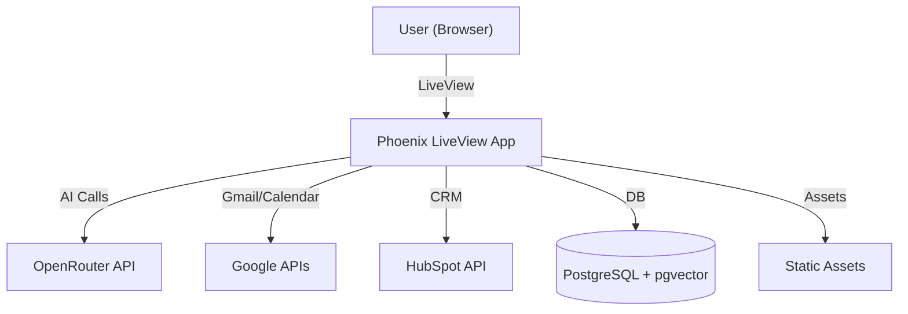

#  AdvisorAI

[](https://advisor-ai.onrender.com)
[](https://github.com/your-username/advisor-ai)

---

> **AdvisorAI** is a next-generation AI assistant platform for financial advisors. It seamlessly integrates Gmail, Google Calendar, and HubSpot CRM into a single, elegant chat interface, empowering advisors to automate workflows, manage client relationships, and boost productivity with real-time AI.

---

## ✨ Features

- 🔐 **Google OAuth Login** (secure, privacy-first authentication)
- 💬 **Modern Chat Interface** (responsive, mobile-ready, real-time)
- 📧 **Gmail Integration** (read, search, send, automate emails)
- 📅 **Google Calendar Integration** (event management, scheduling, reminders)
- 🧠 **RAG (Retrieval-Augmented Generation)** with pgvector for deep context
- 🤖 **Universal AI Agent** (tool calling, memory, multi-step workflows)
- 📝 **Ongoing Instructions** (proactive automation, agent memory)
- 🏷️ **HubSpot CRM Integration** (contacts, notes, client intelligence)
- ⚡ **LiveView Real-time** (instant updates, typing, reactions)
- 🎨 **Professional UI/UX** (dark mode, accessibility, smooth animations)

---

## 🖼️ Screenshots

### Chat Interface


- **Clean, modern chat layout** with user and assistant messages
- **Smart reply suggestions** for quick actions
- **Message reactions** (👍 👎 💡)
- **Voice input** and auto-resizing input box
- **Responsive design** for desktop and mobile

---

### Google OAuth & Integrations

- **One-click Google login** for secure access
- **Easy HubSpot CRM connection**
- **Integration status indicators** in settings

---

### Settings & Automation

- **Manage integrations** (Gmail, Calendar, HubSpot)
- **Configure ongoing instructions** for proactive automation
- **View and edit agent memory**

---

## 🚀 Quick Start

```bash
git clone https://github.com/your-username/advisor-ai.git
cd advisor-ai
mix deps.get
npm install --prefix assets
cp .env.example .env  # Add your API keys
mix ecto.setup
mix phx.server
```

- Visit [http://localhost:4000](http://localhost:4000) to use the app locally.
- For production, deploy to [Render](https://render.com), [Fly.io](https://fly.io), or [Railway](https://railway.app).

---

## 🔑 Environment Variables

- `OPENROUTER_API_KEY` (for AI chat)
- Google OAuth credentials (see Google Cloud Console)
- HubSpot API credentials (for CRM integration)

---

## 🏗️ Architecture



---

## 🧑‍💻 Example Prompts

- "Who mentioned their kid plays baseball?"
- "Why did Greg say he wanted to sell AAPL stock?"
- "Schedule an appointment with Sara Smith"
- "When is my next meeting with Sara Smith?"
- "When someone emails me that is not in HubSpot, create a contact in HubSpot with a note."

---

## 📚 Credits

- Built with [Elixir](https://elixir-lang.org/), [Phoenix LiveView](https://hexdocs.pm/phoenix_live_view/), [Tailwind CSS](https://tailwindcss.com/)
- AI powered by [OpenRouter](https://openrouter.ai/)
- Icons by [Heroicons](https://heroicons.com/)

---

## 📄 License

MIT License. See [LICENSE](LICENSE) for details.

---

<<<<<<< HEAD
**AdvisorAI: The intelligent, secure, and elegant AI assistant for financial professionals.**
=======
**AdvisorAI: The intelligent, secure, and elegant AI assistant for financial professionals.**
>>>>>>> f2abbe3 (chore: commit local changes to allow rebase)
